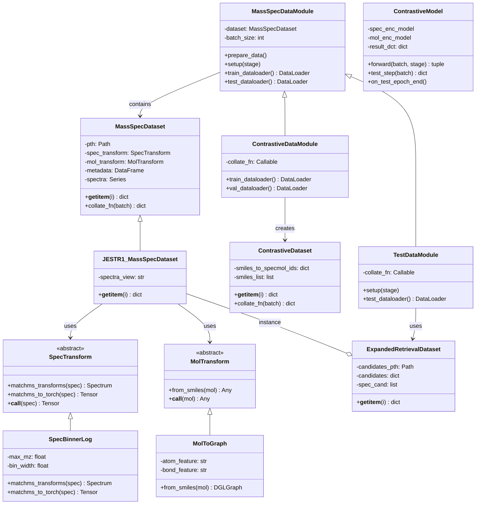
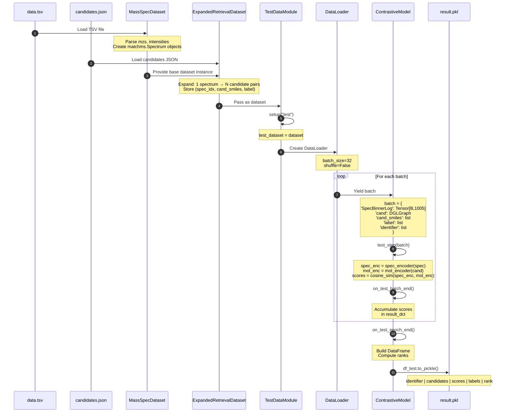
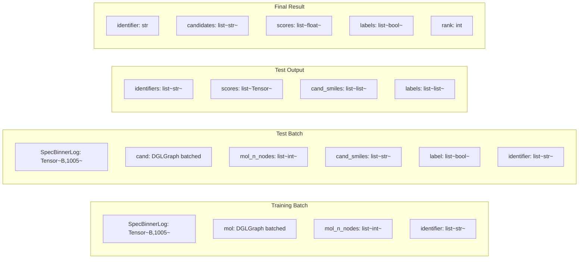
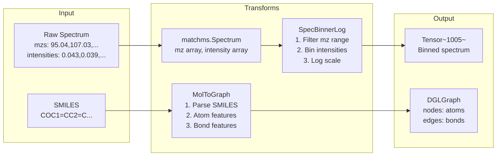
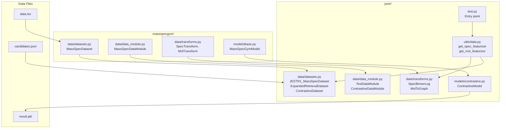

# JESTR1 Data Flow - Mermaid Diagrams

## Class Diagram

```mermaid
classDiagram
    direction TB

    %% Transforms
    class SpecTransform {
        <<abstract>>
        +matchms_transforms(spec) Spectrum
        +matchms_to_torch(spec) Tensor
        +__call__(spec) Tensor
    }

    class SpecBinnerLog {
        -max_mz: float
        -bin_width: float
        +matchms_transforms(spec) Spectrum
        +matchms_to_torch(spec) Tensor
    }

    class MolTransform {
        <<abstract>>
        +from_smiles(mol) Any
        +__call__(mol) Any
    }

    class MolToGraph {
        -atom_feature: str
        -bond_feature: str
        +from_smiles(mol) DGLGraph
    }

    SpecTransform <|-- SpecBinnerLog
    MolTransform <|-- MolToGraph

    %% Datasets
    class MassSpecDataset {
        -pth: Path
        -spec_transform: SpecTransform
        -mol_transform: MolTransform
        -metadata: DataFrame
        -spectra: Series
        +__getitem__(i) dict
        +collate_fn(batch) dict
    }

    class JESTR1_MassSpecDataset {
        -spectra_view: str
        +__getitem__(i) dict
    }

    class ExpandedRetrievalDataset {
        -candidates_pth: Path
        -candidates: dict
        -spec_cand: list
        +__getitem__(i) dict
    }

    class ContrastiveDataset {
        -smiles_to_specmol_ids: dict
        -smiles_list: list
        +__getitem__(i) dict
        +collate_fn(batch) dict
    }

    MassSpecDataset <|-- JESTR1_MassSpecDataset
    JESTR1_MassSpecDataset --o ExpandedRetrievalDataset : instance

    %% DataModules
    class MassSpecDataModule {
        -dataset: MassSpecDataset
        -batch_size: int
        +prepare_data()
        +setup(stage)
        +train_dataloader() DataLoader
        +test_dataloader() DataLoader
    }

    class TestDataModule {
        -collate_fn: Callable
        +setup(stage)
        +test_dataloader() DataLoader
    }

    class ContrastiveDataModule {
        -collate_fn: Callable
        +train_dataloader() DataLoader
        +val_dataloader() DataLoader
    }

    MassSpecDataModule <|-- TestDataModule
    MassSpecDataModule <|-- ContrastiveDataModule

    %% Models
    class ContrastiveModel {
        -spec_enc_model
        -mol_enc_model
        -result_dct: dict
        +forward(batch, stage) tuple
        +test_step(batch) dict
        +on_test_epoch_end()
    }

    %% Relationships
    MassSpecDataModule --> MassSpecDataset : contains
    TestDataModule --> ExpandedRetrievalDataset : uses
    ContrastiveDataModule --> ContrastiveDataset : creates
    JESTR1_MassSpecDataset --> SpecTransform : uses
    JESTR1_MassSpecDataset --> MolTransform : uses
```

## Data Flow Sequence

```mermaid
sequenceDiagram
    autonumber
    participant TSV as data.tsv
    participant JSON as candidates.json
    participant DS as MassSpecDataset
    participant EDS as ExpandedRetrievalDataset
    participant DM as TestDataModule
    participant DL as DataLoader
    participant Model as ContrastiveModel
    participant Result as result.pkl

    TSV->>DS: Load TSV file
    Note over DS: Parse mzs, intensities<br/>Create matchms.Spectrum objects

    JSON->>EDS: Load candidates JSON
    DS->>EDS: Provide base dataset instance
    Note over EDS: Expand: 1 spectrum → N candidate pairs<br/>Store (spec_idx, cand_smiles, label)

    EDS->>DM: Pass as dataset
    DM->>DM: setup("test")
    Note over DM: test_dataset = dataset

    DM->>DL: Create DataLoader
    Note over DL: batch_size=32<br/>shuffle=False

    loop For each batch
        DL->>Model: Yield batch
        Note over Model: batch = {<br/>'SpecBinnerLog': Tensor[B,1005]<br/>'cand': DGLGraph<br/>'cand_smiles': list<br/>'label': list<br/>'identifier': list<br/>}

        Model->>Model: test_step(batch)
        Note over Model: spec_enc = spec_encoder(spec)<br/>mol_enc = mol_encoder(cand)<br/>scores = cosine_sim(spec_enc, mol_enc)

        Model->>Model: on_test_batch_end()
        Note over Model: Accumulate scores<br/>in result_dct
    end

    Model->>Model: on_test_epoch_end()
    Note over Model: Build DataFrame<br/>Compute ranks

    Model->>Result: df_test.to_pickle()
    Note over Result: identifier | candidates | scores | labels | rank
```

## Batch Structure Diagram

```mermaid
graph LR
    subgraph "Training Batch"
        direction TB
        T1[SpecBinnerLog: Tensor~B,1005~]
        T2[mol: DGLGraph batched]
        T3[mol_n_nodes: list~int~]
        T4[identifier: list~str~]
    end

    subgraph "Test Batch"
        direction TB
        E1[SpecBinnerLog: Tensor~B,1005~]
        E2[cand: DGLGraph batched]
        E3[mol_n_nodes: list~int~]
        E4[cand_smiles: list~str~]
        E5[label: list~bool~]
        E6[identifier: list~str~]
    end

    subgraph "Test Output"
        direction TB
        O1[identifiers: list~str~]
        O2[scores: list~Tensor~]
        O3[cand_smiles: list~list~]
        O4[labels: list~list~]
    end

    subgraph "Final Result"
        direction TB
        R1[identifier: str]
        R2[candidates: list~str~]
        R3[scores: list~float~]
        R4[labels: list~bool~]
        R5[rank: int]
    end
```

## Transform Pipeline

```mermaid
flowchart LR
    subgraph Input
        A1[Raw Spectrum<br/>mzs: 95.04,107.03,...<br/>intensities: 0.043,0.039,...]
        A2[SMILES<br/>COC1=CC2=C...]
    end

    subgraph Transforms
        B1[matchms.Spectrum<br/>mz array, intensity array]
        B2[SpecBinnerLog<br/>1. Filter mz range<br/>2. Bin intensities<br/>3. Log scale]
        B3[MolToGraph<br/>1. Parse SMILES<br/>2. Atom features<br/>3. Bond features]
    end

    subgraph Output
        C1[Tensor~1005~<br/>Binned spectrum]
        C2[DGLGraph<br/>nodes: atoms<br/>edges: bonds]
    end

    A1 --> B1 --> B2 --> C1
    A2 --> B3 --> C2
```

## File Dependencies

```mermaid
graph TD
    subgraph "massspecgym/"
        M1[data/datasets.py<br/>MassSpecDataset]
        M2[data/data_module.py<br/>MassSpecDataModule]
        M3[data/transforms.py<br/>SpecTransform, MolTransform]
        M4[models/base.py<br/>MassSpecGymModel]
    end

    subgraph "jestr/"
        J1[data/datasets.py<br/>JESTR1_MassSpecDataset<br/>ExpandedRetrievalDataset<br/>ContrastiveDataset]
        J2[data/data_module.py<br/>TestDataModule<br/>ContrastiveDataModule]
        J3[data/transforms.py<br/>SpecBinnerLog<br/>MolToGraph]
        J4[models/contrastive.py<br/>ContrastiveModel]
        J5[test.py<br/>Entry point]
        J6[utils/data.py<br/>get_spec_featurizer<br/>get_mol_featurizer]
    end

    subgraph "Data Files"
        D1[data.tsv]
        D2[candidates.json]
        D3[result.pkl]
    end

    M1 --> J1
    M2 --> J2
    M3 --> J3
    M4 --> J4

    J5 --> J6
    J6 --> J3
    J6 --> J1

    D1 --> M1
    D2 --> J1
    J4 --> D3
```
